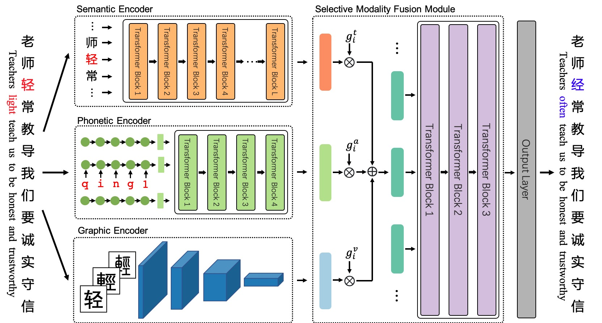

# ReaLiSe

ReaLiSe is a multi-modal Chinese spell checking model. 

This the office code for the paper [Read, Listen, and See: Leveraging Multimodal Information Helps Chinese Spell Checking](https://arxiv.org/abs/2105.12306).

The paper has been accepted in ACL Findings 2021.



## Environment
- Python: 3.6
- Cuda: 10.0
- Packages: `pip install -r requirements.txt`

## Data

### Raw Data
SIGHAN Bake-off 2013: http://ir.itc.ntnu.edu.tw/lre/sighan7csc.html  
SIGHAN Bake-off 2014: http://ir.itc.ntnu.edu.tw/lre/clp14csc.html  
SIGHAN Bake-off 2015: http://ir.itc.ntnu.edu.tw/lre/sighan8csc.html  
Wang271K: https://github.com/wdimmy/Automatic-Corpus-Generation

### Data Processing
The code and cleaned data are in the `data_process` directory.

You can also directly download the processed data from [this](https://drive.google.com/drive/folders/1dC09i57lobL91lEbpebDuUBS0fGz-LAk) and put them in the `data` directory. The `data` directory would look like this:
```
data
|- trainall.times2.pkl
|- test.sighan15.pkl
|- test.sighan15.lbl.tsv
|- test.sighan14.pkl
|- test.sighan14.lbl.tsv
|- test.sighan13.pkl
|- test.sighan13.lbl.tsv
```

## Pretrain

- BERT: chinese-roberta-wwm-ext

    Huggingface `hfl/chinese-roberta-wwm-ext`: https://huggingface.co/hfl/chinese-roberta-wwm-ext  
    Local: `/data/dobby_ceph_ir/neutrali/pretrained_models/roberta-base-ch-for-csc/`

- Phonetic Encoder: `pretrain_pho.sh`
- Graphic Encoder: `pretrain_res.sh`
- Merge: `merge.py`

You can also directly download the pretrained and merged BERT, Phonetic Encoder, and Graphic Encoder from [this](https://drive.google.com/drive/folders/14zQ6L6nAumuBqPO3hV3YzWJHHpTSJir2), and put them in the `pretrained` directory:
```
pretrained
|- pytorch_model.bin
|- vocab.txt
|- config.json
```

## Train
After preparing the data and pretrained model, you can train ReaLiSe by executing the `train.sh` script. Note that you should set up the `PRETRAINED_DIR`, `DATE_DIR`, and `OUTPUT_DIR` in it.

```sh
sh train.sh
```

## Test
Test ReaLiSe using the `test.sh` script. You should set up the `DATE_DIR`, `CKPT_DIR`, and `OUTPUT_DIR` in it. `CKPT_DIR` is the `OUTPUT_DIR` of the training process.

```sh
sh test.sh
```

## Well-trained Model

You can also download well-trained model from [this](https://drive.google.com/drive/folders/1CVUtRhjqwzkx_fi3DbFv4mQ3k2BS88x5) direct using. The performance scores of RealiSe and some baseline models on the SIGHAN13, SIGHAN14, SIGHAN15 test set are here:

**Methods**
- FASpell: [FASPell: A Fast, Adaptable, Simple, Powerful Chinese Spell Checker Based On DAE-Decoder Paradigm](https://www.aclweb.org/anthology/D19-5522/)
- Soft-Masked BERT: [Spelling Error Correction with Soft-Masked BERT](https://www.aclweb.org/anthology/2020.acl-main.82/)
- SpellGCN: [SpellGCN: Incorporating Phonological and Visual Similarities into Language Models for Chinese Spelling Check](https://www.aclweb.org/anthology/2020.acl-main.81/)
- BERT: Our implementation

**Metrics**  
- "D" means "Detection Level", "C" means "Correction Level". 
- "A", "P", "R", "F" means "Accuracy", "Precision", "Recall", and "F1" respectively.

### SIGHAN15

| Method           |  D-A |  D-P |  D-R |  D-F |  C-A |  C-P |  C-R |  C-F |
|------------------|-----:|-----:|-----:|-----:|-----:|-----:|-----:|-----:|
| FASpell          | 74.2 | 67.6 | 60.0 | 63.5 | 73.7 | 66.6 | 59.1 | 62.6 |
| Soft-Masked BERT | 80.9 | 73.7 | 73.2 | 73.5 | 77.4 | 66.7 | 66.2 | 66.4 |
| SpellGCN         |    - | 74.8 | 80.7 | 77.7 |    - | 72.1 | 77.7 | 75.9 |
| BERT             | 82.4 | 74.2 | 78.0 | 76.1 | 81.0 | 71.6 | 75.3 | 73.4 |
| ReaLiSe          | 84.7 | 77.3 | 81.3 | 79.3 | 84.0 | 75.9 | 79.9 | 77.8 |

### SIGHAN14

| Method           |  D-A |  D-P |  D-R |  D-F |  C-A |  C-P |  C-R |  C-F |
|------------------|-----:|-----:|-----:|-----:|-----:|-----:|-----:|-----:|
| Pointer Network  |    - | 63.2 | 82.5 | 71.6 |    - | 79.3 | 68.9 | 73.7 |
| SpellGCN         |    - | 65.1 | 69.5 | 67.2 |    - | 63.1 | 67.2 | 65.3 |
| BERT             | 75.7 | 64.5 | 68.6 | 66.5 | 74.6 | 62.4 | 66.3 | 64.3 |
| ReaLiSe          | 78.4 | 67.8 | 71.5 | 69.6 | 77.7 | 66.3 | 70.0 | 68.1 |

### SIGHAN13

| Method           |  D-A |  D-P |  D-R |  D-F |  C-A |  C-P |  C-R |  C-F |
|------------------|-----:|-----:|-----:|-----:|-----:|-----:|-----:|-----:|
| FASpell          | 63.1 | 76.2 | 63.2 | 69.1 | 60.5 | 73.1 | 60.5 | 66.2 |
| SpellGCN         | 78.8 | 85.7 | 78.8 | 82.1 | 77.8 | 84.6 | 77.8 | 81.0 |
| BERT             | 77.0 | 85.0 | 77.0 | 80.8 | 77.4 | 83.0 | 75.2 | 78.9 |
| ReaLiSe          | 82.7 | 88.6 | 82.5 | 85.4 | 81.4 | 87.2 | 81.2 | 84.1 |

## Citation
```bibtex
@misc{xu2021read,
      title={Read, Listen, and See: Leveraging Multimodal Information Helps Chinese Spell Checking}, 
      author={Heng-Da Xu and Zhongli Li and Qingyu Zhou and Chao Li and Zizhen Wang and Yunbo Cao and Heyan Huang and Xian-Ling Mao},
      year={2021},
      eprint={2105.12306},
      archivePrefix={arXiv},
      primaryClass={cs.CL}
}
```
